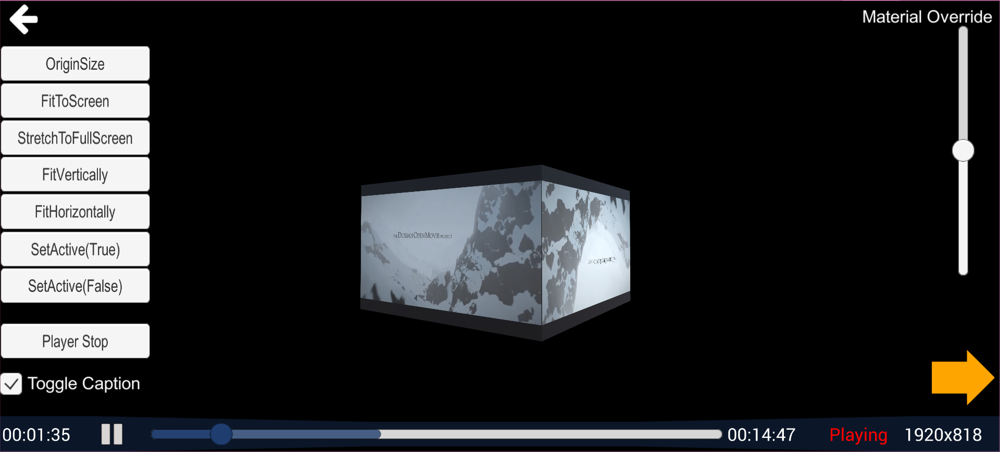
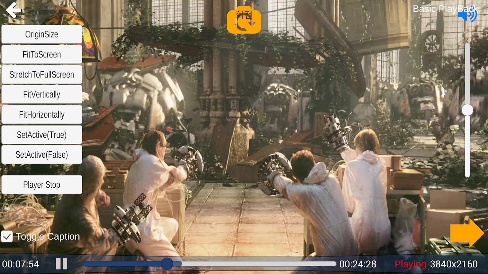

## NexPlayer™ Unity Plugin


NexPlayer™ for Unity is a multiscreen streaming player for Unity apps that supports both standard and 360 video playback across all Android, iOS and PC devices. NexPlayer™ for Unity is the only playback solution for Unity that supports HLS &amp; DASH live streaming across all devices, advanced events and out of the box 360 video navigation.

This repository contais the sample demo code of NexPlayer™ plugin. If you want to get our full working demo, contact us in our [website](https://www.nexplayersdk.com/contact/).



## Features

- Support protocols for ABR algorithm, including HLS and DASH
- Support for progressive download (eg. online .mp4)
- Support local videos
- Complete API including:
    - Play / Pause
    - Seek
    - Video resolution
    - Last millisecond buffered
- Useful callbacks including:
    - Information about the buffering state
    - Track change
    - State of the playback
- Widevine DRM on Android and iOS for DASH videos
- DRM on local videos and streaming

## Supported Platform
| Platform | Supported Graphics APIs | HLS | DASH | Local | Inside App (Streaming Assets) |
| ------ | ------ | ------ | ------ | ------ | ------ |
| Android (armeabi-v7a and x86) | OpenGLES2, OpenGLES3 | O | O | O | O |
| iOS | OpenGLES2, OpenGLES3, Metal | O | O | O | O |


## NexPlayer360™
NexPlayer™ Plugin for Unity includes many of the features of [NexPlayer360 SDK](https://nexplayersdk.com/nexplayer-360/), such as:
- Touch input, including movement, zoom and rotation of the camera
- Gyroscope input to move the camera
- Mouse input to move the camera
- Automatic Ground Leveler to stabilize the video
- Custom shaders to map 2D, 3D Over/Under and 3D Left/Right 360 videos
- Customizable key controls
- VR supported scenes


## Documentation
Here the official [documentation](NexPlayer_Plugin_for_Unity_Reference_Manual.pdf) of NexPlayer™ Unity Plugin.


## How to use it


### Quick start
#### 1) Play standard video

Create a new [Unity](https://unity3d.com/) project and import the NexPlayer™ Plugin.


In order to load the player [Scene](https://docs.unity3d.com/Manual/UsingTheSceneView.html) follow the path: 'Assets/NexPlayer/Scenes' and open 'NexPlayer raw video.unity' with double click.
Test the playback selecting play button in the editor.



#### 2) Play 360 scene

Load the 360 [Scene](https://docs.unity3d.com/Manual/UsingTheSceneView.html) available in 'Assets/NexPlayer/NexPlayer360/Scenes/NexPlayer360.unity'.
Test the playback selecting play button in the editor.


#### 3) Load NexPlayer™ demo

Add the following scenes to the Unity build:

- Assets/NexPlayer/Scenes/MainMenu.unity
- Assets/NexPlayer/Scenes/NexPlayer_MaterialOverride_Sample.unity
- Assets/NexPlayer/Scenes/NexPlayer_RawImage_Sample.unity
- Assets/NexPlayer/Scenes/NexPlayer_RenderTexture_Sample.unity

Switch to the desired platform.


#### 4) Configuration steps

Graphics APIs:
- Manually, select the compatible graphics APIs manually in "Player Settings" section of Unity for each platform.
- Automatically, if the helper
component NexEditorHelper.cs is attached to any GameObject. It will include a graphics UI to
auto detect any conflict regarding the graphics API, and it will promptly solve it.

Android platform:
- To allow any remote video select the true value for "Internet Access" option in the Unity
player settings.
- Set "Write Permision" to External (SDcard)

iOS platform:
- To view HTTP videos enable "Allow downloads over HTTP" option.

A quick and easy way to enable these settings is using the helper component
(NexEditorHelper.cs).

[Virtual Reality](https://en.wikipedia.org/wiki/Virtual_reality) mode:
- Go to "Player Settings" --> "Other Settings" and select the desired VR mode (depends on the Unity version used).
If "Oculus" is selected, remember to [generate the OSIG file](https://developer.oculus.com/osig/) for the device and add it into 'Assets/Plugins/Android/Assets'.


### NexPlayer™ integration

An example of using NexPlayer™ can be found in the script NexPlayer.cs.
It has to be attached to some game object that has a material and a
texture. The URL and the text fields used to update the status can be personalized.

A custom implementation of NexPlayer™ can also be done manually:

```
void Start ()
{
    // Creation of the NexPlayer instance
    player = NexPlayerFactory.GetNexPlayer();
    // Register to the events of NexPlayer
    player.OnEvent += EventNotify;
    // Initialize NexPlayer with an URI
    player.Init(URL, true, false);
    // The coroutine needs to be started after the player is created an initialized
    StartCoroutine(player.CoroutineEndOfTheFame());
}
```

The update method of the player needs to be called at the Update callback of the
MonoBehaviour object:

```
void Update()
{
    player.Update();
}
```

The previously used Action needs to be declared. It will provide a number of helpful callbacks.
Properly assigning the texture to the material used by the game object should be done in the correct callback.

```
void EventNotify(NexPlayerEvent paramEvent, int param1, int param2)
{
    switch(paramEvent)
    {
        case NexPlayerEvent.NEXPLAYER_EVENT_TEXTURE_CHANGED:
            // It's important to change the texture of every Unity object that should
            display the video frame when this callback is called
            GetComponent<Renderer>().material.mainTexture = player.GetTexture (); break;
    }
}
```

Release the player using the ClosePlayback method and wait for the
NEXPLAYER_EVENT_CLOSED callback:

```
public void ToogleQuit()
{
player.ClosePlayback();
}

void EventNotify(NexPlayerEvent paramEvent, int param1, int param2)
{
    switch (paramEvent)
    {
        case NexPlayerEvent.NEXPLAYER_EVENT_CLOSED:
        {
            Application.Quit();
        }
        break;
    }
}
```

### NexPlayer™ 360 Integration

The script NexPlayer360.cs provides the most important functionalities of
a 360 viewer.
It can be used as a reference for a custom integration.

To integrate the
AutomaticGroundLeveler use the following code:

```
void Awake()
{
    agl = new AutomaticGroundLeveler();
}

void Update (){
    //Move the camera with a custom login
    //Stabilize the camera
    agl.AutomaticGroundLevelerStep(cameraToRotate.transform, latestAttitude, rotating);
}
```


-------------------


## Contact
[supportmadrid@nexstreaming.com](mailto:supportmadrid@nexstreaming.com)

## License
[NexPlayer for Unity Product License](resources/License.txt)